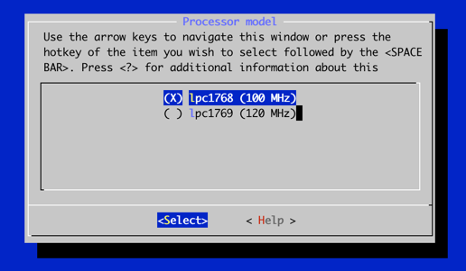
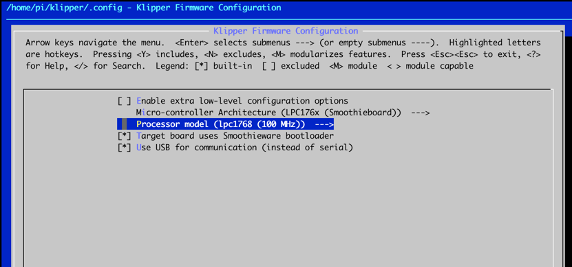

# SKR 1.3/1.4 Klipper Firmware

The firmware update process for both SKR 1.3 and SKR 1.4 is the same so the guides have been combined.

### Required Items

* Klipper must be installed onto the Raspberry Pi
* At least one microSD card needs to be available depending on number of controllers.

### Build Firmware Image

* Login to the Raspberry Pi
* Run the following:

```
sudo apt install make
cd ~/klipper
make menuconfig
```

In the menu structure there are a number of items to be selected.

* Ensure that the micro-controller architecture is selected to be 'LPC176x'
* If the SKR is a Turbo model, be sure to select 120MHz.
* If the SKR is a non-Turbo model, be sure to select 100MHz.



* Enable "Target board uses Smoothieware bootloader"
* Enable "Use USB for communication (instead of serial)"



Once the configuration is selected, select "Exit" and "Yes" if asked to save the configuration.

Run the following:

```
make clean
make
```

The `make` command, when completed, creates a firmware file **klipper.bin** that is store in the folder `/home/pi/klipper/out`.  This file need to be copied to both of the SKR boards.  The easiest way to do this is to use a GUI like [WinSCP](https://winscp.net/eng/download.php) on Windows or either [Cyberduck](https://cyberduck.io) or scp (from terminal) on Mac to copy the file to your computer.


### Load Firmware Image

Copy the **klipper.bin** to the desktop, then rename it to **firmware.bin**

**Important:** If the file is not renamed, the bootloader will not be updated properly.

Ensure that all SKR boards are not powered, then remove the microSD card(s) that are installed.

Connect one of the microSD cards to the computer with the **firmware.bin** file.  Open the microSC card in the file browser.  There will be a file named 'firmware.cur', that file can be deleted or left alone, it will be overwritten later.

Copy the **firmware.bin** from the desktop onto the microSD card.  If problems are encountered transferring the file(s) to the microSD card, reformat the microSD card with a FAT32 filesystem and try again.

_V2:_ Repeat the process with the second microSD card.

Replace the microSD card(s) into the SKR(s).  If more than one, it does not matter which card goes into which controller.

Turn on the power supply to power on the SKR board(s).  If named properly, the SKR will automatically update with the Klipper firmware.

**Important:** If the SKR(s) are not powered with 12-24V, Klipper will be unable to communicate with the TMC drivers via UART and the SKR will automatically shut down.

### Back to [Software Installation](./index.md#klipper-octoprint-configuration)
